```
┌─────────────────────────────────────────────────────────────────────────────┐
│                                                                             │
│   ██████╗ ██╗  ██╗                                                          │
│   ██╔══██╗██║  ██║                                                          │
│   ██████╔╝███████║                                                          │
│   ██╔═══╝ ╚════██║                                                          │
│   ██║          ██║                                                          │
│   ╚═╝          ╚═╝                                                          │
│                                                                             │
│   ███████╗ ██████╗ ██╗   ██╗███████╗██████╗ ███████╗██╗ ██████╗ ███╗   ██╗ │
│   ██╔════╝██╔═══██╗██║   ██║██╔════╝██╔══██╗██╔════╝██║██╔════╝ ████╗  ██║ │
│   ███████╗██║   ██║██║   ██║█████╗  ██████╔╝█████╗  ██║██║  ███╗██╔██╗ ██║ │
│   ╚════██║██║   ██║╚██╗ ██╔╝██╔══╝  ██╔══██╗██╔══╝  ██║██║   ██║██║╚██╗██║ │
│   ███████║╚██████╔╝ ╚████╔╝ ███████╗██║  ██║███████╗██║╚██████╔╝██║ ╚████║ │
│   ╚══════╝ ╚═════╝   ╚═══╝  ╚══════╝╚═╝  ╚═╝╚══════╝╚═╝ ╚═════╝ ╚═╝  ╚═══╝│
│                                                                             │
│   ██████╗ ██████╗ ██╗   ██╗    ███████╗███████╗██╗    ███████╗████████╗     │
│   ██╔════╝ ██╔══██╗██║   ██║    ██╔════╝██╔════╝██║    ██╔════╝╚══██╔══╝     │
│   ██║  ███╗██████╔╝██║   ██║    █████╗  █████╗  ██║    ███████╗   ██║        │
│   ██║   ██║██╔═══╝ ██║   ██║    ██╔══╝  ██╔══╝  ██║    ╚════██║   ██║        │
│   ╚██████╔╝██║     ╚██████╔╝    ██║     ██║     ██║    ███████║   ██║        │
│    ╚═════╝ ╚═╝      ╚═════╝     ╚═╝     ╚═╝     ╚═╝    ╚══════╝   ╚═╝        │
│                                                                             │
│   Hand-Rolled GPU Compute · Metal + CUDA · Unified C ABI                    │
│   No frameworks · No fallbacks · Deterministic dispatch                     │
│                                                                             │
└─────────────────────────────────────────────────────────────────────────────┘
```


---

## What is this?

P4 is a hand-rolled, low-level compute stack with two complementary subsystems that work at opposite ends of the hardware abstraction: a GPU compute layer that runs kernels directly on Apple Metal and NVIDIA CUDA hardware, and a hardware model layer called Switchboard that formally describes the digital circuits those kernels ultimately execute on — from VHDL behavioural description down through CMOS transistor netlists, SPICE decks, and IEEE std_logic simulation.

The GPU compute layer exposes native Metal and CUDA kernels through a unified FFI architecture. Every kernel is hand-written. Every interface is explicit. Nothing is delegated to a framework. Six layers, one stable C ABI boundary between them:

- **ABI** — Stable C types, opaque handles, kernel IDs. The line that nothing crosses except plain C.
- **Apple Metal** — Objective-C FFI to Metal runtime. Hand-written MSL kernels. No MPS. No MetalKit.
- **NVIDIA CUDA** — CUDA runtime + NVRTC compile. Hand-written CUDA kernels. No cuDNN. No cuBLAS.
- **Mojo** — Numerical layer. Device abstraction, buffer management, kernel dispatch. Owns the math API.
- **Crystal** — Systems orchestration. Process lifecycle, kernel registry, device discovery, job routing.
- **CPU Reference** — Scalar reference implementations for every kernel. Verification oracle.

Switchboard is the seventh layer, working from the opposite direction. Where the GPU stack abstracts away from hardware, Switchboard descends toward it — taking a 4-bit ripple-carry datapath from a VHDL description through five lowering phases: Swift structural model, CMOS transistor netlist, SPICE deck, executable MetaShard graph with delta-cycle simulation, IEEE std_logic waveforms and PWL stimulus, and a canonical IR with machine-checkable equivalence closure witnesses. The result is a formal account of the hardware that the GPU kernels run on.

15 constraints enforced. No cloud GPU dependency. No SaaS inference. No mandatory Python runtime. No silent backend fallback. Explicit failure on unsupported capabilities.

---

## Architecture

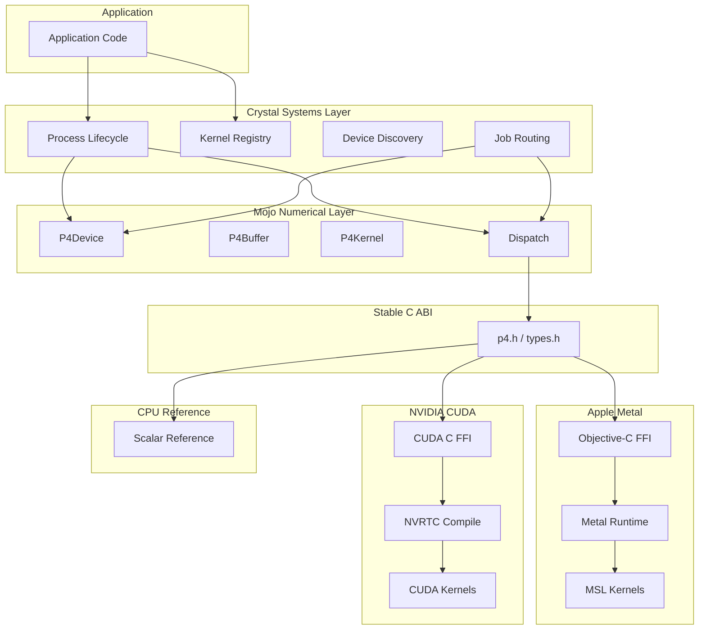

## Switchboard — Hardware Lowering Stack

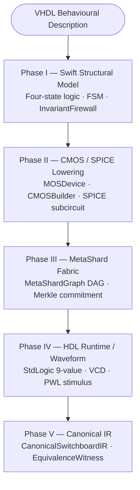

## Kernel Dispatch Pipeline


## Backend Capabilities

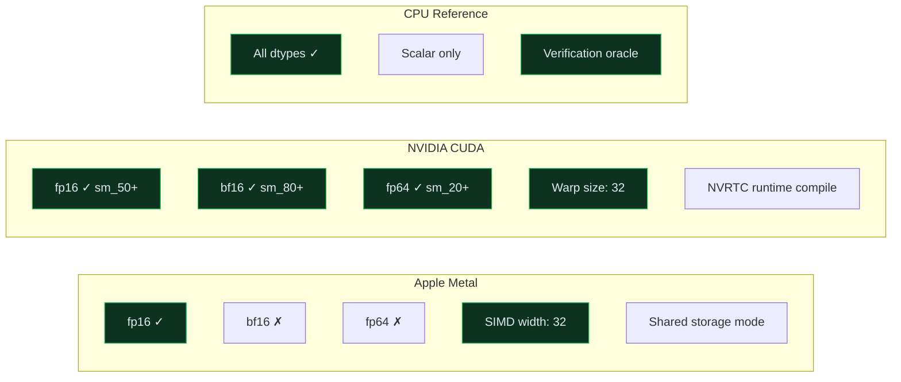

## Kernel Matrix

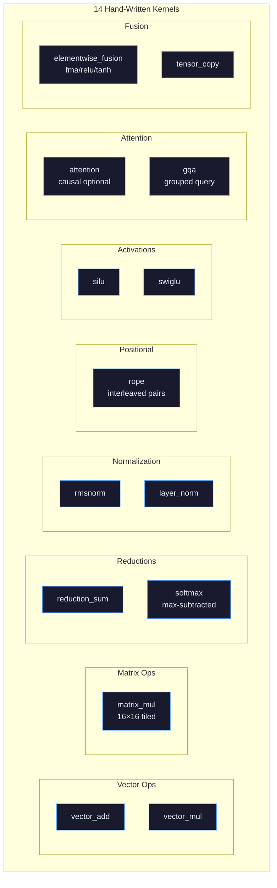

---

## Design Constraints

| ID | Constraint | Enforcement |
|----|-----------|-------------|
| P4-1 | No cloud GPU dependency | All compute is local hardware |
| P4-2 | No SaaS inference dependency | No external API calls |
| P4-3 | No mandatory Python runtime | C ABI + Mojo + Crystal |
| P4-4 | No high-level GPU framework in core | No MPS, cuDNN, cuBLAS |
| P4-5 | Objective-C handles Apple Metal boundary | Direct Metal API |
| P4-6 | MSL kernels are hand-written | 13 kernels in p4_kernels.metal |
| P4-7 | CUDA kernels are hand-written | 12 kernels in p4_kernels.cu |
| P4-8 | Mojo owns numerical/kernel API | Device, Buffer, Kernel structs |
| P4-9 | Crystal owns systems orchestration | Registry, Runtime, routing |
| P4-10 | C ABI is stable interop boundary | abi/p4.h + abi/types.h |
| P4-11 | Cross-backend mathematical contracts | FNV-1a source hashing |
| P4-12 | Every kernel independently testable | Per-kernel verification API |
| P4-13 | Reproducible version & source hashes | version.h + kernel_record |
| P4-14 | Explicit failure on unsupported caps | P4_ERR_UNSUPPORTED |
| P4-15 | No silent backend fallback | P4_ERR_NO_FALLBACK |

---

## Project Structure

```
p4/
├── abi/                          Stable C ABI
│   ├── p4.h                      Single interoperability boundary
│   ├── types.h                   Primitive types, opaque handles, kernel IDs
│   └── version.h                 Version and ABI version
│
├── apple/                        Apple Platform
│   ├── objc/
│   │   ├── p4_metal.h            Public C header
│   │   └── p4_metal.m            Objective-C implementation
│   ├── msl/
│   │   └── p4_kernels.metal      14 hand-written MSL kernels
│   └── swift/
│       └── switchboard/
│           ├── Switchboard.swift              Phase I — structural model
│           ├── SwitchboardPhaseII.swift       Phase II — CMOS / SPICE lowering
│           ├── SwitchboardPhaseIII.swift      Phase III — MetaShard fabric
│           ├── SwitchboardPhaseIV.swift       Phase IV — HDL runtime / waveform
│           └── SwitchboardPhaseV.swift        Phase V — canonical IR
│
├── nvidia/                       NVIDIA CUDA Backend
│   ├── cuda/
│   │   ├── p4_cuda.h             Public C header
│   │   └── p4_cuda.cu            CUDA runtime + NVRTC implementation
│   └── kernels/
│       └── p4_kernels.cu         12 hand-written CUDA kernels
│
├── mojo/                         Mojo Numerical Layer
│   ├── ffi/
│   │   └── p4_ffi.mojo           C ABI bindings
│   ├── device/
│   │   └── p4_device.mojo        Backend-neutral device API
│   └── kernels/
│       └── p4_kernels.mojo       Kernel dispatch + named constructors
│
├── crystal/                      Crystal Systems Layer
│   ├── registry/
│   │   └── p4_registry.cr        Kernel registry + hash verification
│   └── runtime/
│       ├── abi.cr                 Crystal C ABI bindings
│       └── p4_runtime.cr         Device discovery + job routing
│
├── tests/                        Verification suite
├── benchmarks/                   Performance layer
├── docs/                         Architecture documentation
└── scripts/                      Build scripts
```

---

## Build

Platform-specific. Metal backend requires macOS + Xcode. CUDA backend requires nvcc + NVRTC.

```bash
# Apple Metal (macOS)
clang -framework Metal -framework Foundation -c apple/objc/p4_metal.m -o build/p4_metal.o
xcrun metal -c apple/msl/p4_kernels.metal -o build/p4_kernels.air

# NVIDIA CUDA
nvcc -c nvidia/kernels/p4_kernels.cu -o build/p4_kernels.o
nvcc -c nvidia/cuda/p4_cuda.cu -o build/p4_cuda.o -lnvrtc

# Mojo
mojo build mojo/ffi/p4_ffi.mojo

# Crystal
crystal build crystal/runtime/p4_runtime.cr

# Swift Switchboard (requires Swift 5.9+, macOS 13+)
swiftc apple/swift/switchboard/Switchboard.swift \
       apple/swift/switchboard/SwitchboardPhaseII.swift \
       apple/swift/switchboard/SwitchboardPhaseIII.swift \
       apple/swift/switchboard/SwitchboardPhaseIV.swift \
       apple/swift/switchboard/SwitchboardPhaseV.swift \
       -module-name Switchboard -emit-library
```

---

## Switchboard

Switchboard is a pure-Swift, zero-dependency hardware description and verification pipeline. It starts from a 4-bit ripple-carry adder with a three-state FSM and tri-state output bus — the same form as a synthesisable VHDL design — and carries that description through five lowering phases until it reaches a canonical IR with machine-checkable equivalence witnesses.

The GPU compute stack knows about thread topology and memory bandwidth. It does not know about logic families, transistor sizing, carry propagation delay, or clock domain crossing. Switchboard fills that gap from the opposite direction: starting from a VHDL behavioural description and descending through gates, transistors, SPICE netlists, and simulation semantics until it reaches a representation formally comparable to the behavioural original.

No Apple frameworks beyond `Foundation`. No LLVM intrinsics. No assembly. Every boundary is testable, every invariant is named, every lowering step can be audited without a toolchain.

---

## Switchboard — Five Phase Overview

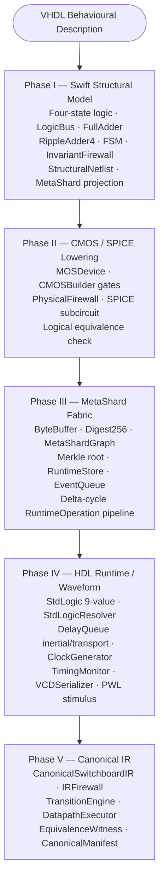

---

## Phase I — Swift Structural Hardware Model

**File:** `apple/swift/switchboard/Switchboard.swift`

Phase I is the foundation of the entire Switchboard stack. It translates the structural and behavioural content of a VHDL full-adder and ripple-carry switchboard design into idiomatic, strongly-typed Swift. There are no bit-fields, no unsafe memory operations, and no integer casts that could silently carry a wrong value. Every primitive is named, every width is enforced at the precondition boundary, and every logic value is explicitly one of four cases.

### Four-State Logic

The `Logic` enum is a `@frozen` four-value type: `zero`, `one`, `x`, and `z`. It maps directly onto the compact subset of VHDL `std_logic` that matters for functional simulation: driven low, driven high, unknown, and high-impedance. The `@frozen` attribute is not cosmetic — it prevents retroactive extension and ensures that `switch` exhaustion is checked at compile time rather than hidden behind a `default` arm.

The three infix operators `&`, `|`, and `^` implement IEEE four-valued boolean algebra. The AND operator returns `.zero` whenever either operand is `.zero` regardless of the other operand's value — which correctly models a gate whose pull-down path is complete even in the presence of unknown inputs. The OR operator returns `.one` whenever either operand is `.one`. The XOR operator promotes any unknown input to `.x` in the output, preserving ignorance rather than guessing. The prefix `~` (NOT) maps `.z` to `.x` because a floating input that is inverted produces an unknown output, not a valid complement.

### LogicBus

`LogicBus` is a fixed-width vector of `Logic` values stored in LSB-first order. The width is set at construction time and never changes. Subscript access is bounds-checked through `precondition`. The type exposes `unsignedValue` which returns `nil` if any bit is not in a known state, preventing silent conversion of unknown logic to integer arithmetic. It also exposes `highImpedance`, `unknown`, and `zero` static factory methods used throughout the codebase to construct bus values of known quality without repeating fill logic.

The `description` property renders the bus MSB-first in the conventional display order, so a bus holding binary `0110` displays as `0110` with the most significant bit on the left. This matches how waveform viewers render vector signals.

### FullAdder and RippleAdder4

`FullAdder.evaluate` is a pure function. It takes an `Input` of three `Logic` values and returns an `Output` of sum and carry. The implementation uses the two XOR, one AND, one OR gate pattern: `xy = x ^ y`, `sum = xy ^ cin`, `carry = (x & y) | (cin & xy)`. This is structurally identical to the VHDL concurrent signal assignment and is the reference implementation against which every other adder expression in the codebase is compared.

`RippleAdder4` chains four `FullAdder.evaluate` calls in sequence, threading the carry output of each cell into the carry input of the next. The carry-in of the first cell is hardwired to `.zero`. The carry-out of the last cell becomes `c3` — the overflow signal. The four sum bits and the four carry bits are returned together in a `DatapathResult`. Nothing in this function allocates on the heap.

### SwitchboardState FSM

The FSM has three states: `IDLE`, `READ`, and `WRITE`. The encoding is `@frozen` — values `0b00`, `0b01`, `0b10` — so the two-bit encoding used in SPICE and MetaShard projections is always consistent with the Swift representation. The nominal transition graph is:

```
IDLE → READ   (when any input bit is high)
READ → WRITE  (unconditional, one cycle)
WRITE → IDLE  (unconditional, one cycle)
```

Reset overrides all transitions to `IDLE` with priority. The `busActivity` helper checks whether either input bus has any bit high, implementing the VHDL `if (a or b) /= "0000"` condition without constructing an intermediate value.

### Invariant Firewall

The `InvariantFirewall` is a post-evaluation checker applied to every `SwitchboardSnapshot`. It does not trust the implementation under test. Instead it independently re-evaluates each carry boundary using fresh `FullAdder.evaluate` calls and compares the results against what the machine reported. If the machine's carry chain disagrees with the oracle, invariant I3 fires.

The five invariants are:

| ID | Description |
|----|-------------|
| I2 | Input buses A and B are exactly four bits wide |
| I3 | Each carry bit agrees with an independent full adder evaluation |
| I4 | The overflow signal equals the final carry C3 |
| I5 | The FSM state is one of the three legal values |
| I6 | Reset forces the next state to IDLE; READ transitions to WRITE; WRITE transitions to IDLE |

All five checks run on every clock edge. The firewall runs both before and after the state register updates, catching violations in either the combinational or sequential domain.

### MetaShard Projection

Every `SwitchboardSnapshot` can be projected into a flat list of `MetaShard` values. Each shard carries a deterministic `ShardID` derived from a FNV-1a 64-bit hash of its semantic path — for example `"cycle:7:carry"`. The shard kind distinguishes signals, cells, states, observations, and transitions. Field values are typed through the `MetaValue` enum which covers logic, bus, unsigned integer, signed integer, floating-point, text, and boolean payloads. The resulting shards can be committed into a `MetaShardGraph` in Phase III or serialised to any downstream system that consumes structured execution traces.

### Structural Netlist and SPICE Circuit IR

`SwitchboardNetlist.build` constructs a gate-level netlist as a set of named nets and a list of `Cell` instances each carrying typed pins. This is the structural view that a synthesis tool would emit after technology mapping. The netlist makes the carry chain topology explicit as named `NetID` values — `C0`, `C1`, `C2`, `C3` — and declares the four full-adder cells with their six pins each.

`SwitchboardSPICE.build` projects the same topology into a SPICE circuit IR: a `VDD` source at 1.8 V and four `FULL_ADDER` subcircuit instances with their nodes connected following the ripple-carry topology. The SPICE IR is independent of the physical cell library — it references the `FULL_ADDER` subcircuit by name, which Phase II will generate.

---

## Phase II — CMOS / SPICE Lowering

**File:** `apple/swift/switchboard/SwitchboardPhaseII.swift`

Phase II descends from the logical full-adder primitive to its transistor-level implementation. It builds a CMOS cell using the standard gate decomposition, runs a physical topology audit, emits a complete SPICE subcircuit, and verifies logical equivalence between the two implementations.

### Physical Identifiers

`DeviceID` and `PhysicalNet` are distinct types wrapping strings. They are not interchangeable even though both carry a string. This prevents a gate terminal from being accidentally used as a net name or vice versa. `precondition(!rawValue.isEmpty)` enforces non-empty identity at construction.

`MOSKind` distinguishes NMOS and PMOS. `MOSGeometry` carries width and length in meters as `Double` values. The canonical minimum sizes are `0.36 µm / 0.18 µm` for NMOS and `0.72 µm / 0.18 µm` for PMOS — a 2:1 width ratio that preserves approximately equal drive strength given the typical PMOS/NMOS carrier mobility difference at 180 nm process geometry.

### CMOSBuilder and Gate Primitives

`CMOSBuilder` is a value-type accumulator. It allocates internal nets and devices through deterministic index-based allocators, so the same builder sequence always produces the same device names regardless of execution environment. The builder exposes six primitives:

**Inverter:** PMOS pull-up from VDD, NMOS pull-down to VSS, both gates driven by the same input net, both drains tied to the output net.

**NAND2:** Two PMOS pull-up devices in parallel between VDD and the output, two NMOS pull-down devices in series between the output and VSS. Series NMOS implements the AND function in the pull-down network; the output is only pulled low when both inputs are high. Parallel PMOS ensures the output is pulled high whenever either input is low.

**AND2:** NAND2 followed by an inverter. The internal NAND output is an anonymous net allocated by `internalNet`.

**NOR2:** Two PMOS pull-up devices in series between VDD and the output, two NMOS pull-down devices in parallel between the output and VSS. The dual of NAND2.

**OR2:** NOR2 followed by an inverter.

**XOR2:** Structural decomposition using inverters and AND2/OR2 primitives. `notA = NOT(A)`, `notB = NOT(B)`, `term0 = AND(A, notB)`, `term1 = AND(notA, B)`, `output = OR(term0, term1)`. This is deliberately not the classical four-NMOS / four-PMOS CMOS XOR optimisation. The structural decomposition makes the Boolean identity explicit at the level of named sub-networks, which is what the logical equivalence checker needs to make independent comparisons.

### CMOSFullAdder

`CMOSFullAdder.build` applies the CMOS gate primitives to construct a complete full adder cell. The propagate signal `P = XOR(X, Y)`. The sum output `S = XOR(P, CIN)`. The carry-generate signal `XY = AND(X, Y)`. The carry-propagate signal `CP = AND(CIN, P)`. The carry output `COUT = OR(XY, CP)`. Five sub-networks, three intermediate nets, no loops.

### PhysicalFirewall

The physical firewall validates the assembled `PhysicalCell` before any SPICE emission. It checks:

- The cell has at least one device (`emptyCell`)
- All seven required ports are present: X, Y, CIN, S, COUT, VDD, VSS
- Every device ID is unique (`duplicateDevice`)
- Every NMOS body connects to VSS; every PMOS body connects to VDD (`invalidBodyConnection`)
- VDD and VSS rails exist in the topology (`missingRail`)
- No internal net is floating — every internal net must appear on at least one device drain, source, or gate (`floatingInternalNet`)

All failures are typed through `PhysicalAuditFailure` and thrown as Swift errors, not printed as warnings. There is no partial validation.

### SPICE Emission Pipeline

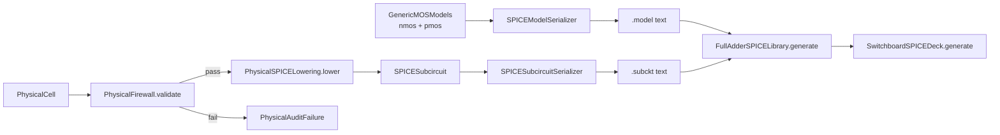

`PhysicalSPICELowering.lower` maps each `MOSDevice` to a SPICE `M` element line. The drain, gate, source, and body nets are written in SPICE MOSFET order. VSS maps to SPICE ground node `0`. Width and length are formatted in microns with a `u` suffix using `SPICENumber.meters`. The SPICE output is deterministic for a given input cell because the device list preserves insertion order and the device allocator is index-based.

`GenericMOSModels` provides Level-1 SPICE model cards for NMOS and PMOS. These are explicitly generic educational models — threshold voltage 0.45 V NMOS / -0.45 V PMOS, transconductance parameter 120 µA/V² and 50 µA/V², channel length modulation 0.04 and 0.05. They are correct enough for DC operating point and rough transient simulation but not representative of any specific fabrication process. A production PDK model card replaces these entries without touching the surrounding infrastructure.

`CarryChainPhysicalAudit.validate` checks the four `SPICEInstance` entries in `PhysicalSwitchboard.instances()` for structural correctness: exactly four instances, correct names and order, FA0's CIN tied to ground, each FA(n)'s COUT connected to FA(n+1)'s CIN, FA3's COUT named `C3`.

### Gate-Level Reference Evaluator and Equivalence Check

`CMOSReferenceLogic` re-implements the full adder using the same structural gate decomposition as the CMOS builder — NOT, AND, OR, XOR from primitives — without calling `FullAdder.evaluate`. `CMOSLogicalEquivalence.verify` then runs all eight binary input vectors through both `FullAdder.evaluate` and `CMOSReferenceLogic.fullAdder` and compares their outputs. Any disagreement is recorded as a failure string. This gives a complete semantic boundary check before an external analog SPICE engine is introduced.

---

## Phase III — Executable MetaShard Fabric

**File:** `apple/swift/switchboard/SwitchboardPhaseIII.swift`

Phase III lifts the execution model from a simple function call into a deterministic graph of operations scheduled across simulation time with delta-cycle semantics.

### Byte Buffer and Digest Engine

`ByteBuffer` is a simple value-type byte accumulator with big-endian multi-width append operations for `UInt16`, `UInt32`, `UInt64`, and length-prefixed UTF-8 strings. It is the canonical serialisation substrate for everything that needs a deterministic byte representation — shard content, graph topology, IR encoding.

`Digest256` is a 128-bit (four `UInt64`) structural hash value. `DigestEngine.hash` implements a custom mixing function derived from FNV and Murmur3 constants with rotation. It is a deterministic commitment primitive — not a cryptographic hash, but sufficient to establish structural identity across execution environments. The mixing constants are published in the source code so any other implementation can reproduce the same digests. `DigestEngine.combine` hashes the concatenation of two existing `Digest256` byte arrays to produce a parent hash, enabling Merkle tree construction.

### MetaShardCanonicalEncoding

Each `MetaShard` is encoded to a `ByteBuffer` in a canonical form that is independent of Swift dictionary ordering. Shard ID and kind are written first. Fields are sorted by key name before encoding, so two shards with identical content but fields added in different order produce identical digests. `MetaValueCanonicalEncoding` uses a one-byte type tag followed by the value payload, giving a self-describing binary encoding that requires no schema to parse.

### MetaShardGraph

`MetaShardGraph` is a directed acyclic graph of `ExecutableShard` nodes connected by typed `MetaShardEdge` edges. Edge kinds are `data`, `control`, `carry`, `invariant`, `provenance`, and `physical`. The graph enforces no self-edges, no duplicate edges, and referential integrity on both ends of every edge at insertion time. `topologicalOrder` uses Kahn's algorithm — initialise in-degree counters, repeatedly extract zero-in-degree nodes in sorted order, decrement successors. If any nodes remain after the queue empties, a cycle exists and `MetaShardGraphError.cycleDetected` is thrown.

`MetaShardMerkle.root` builds a binary Merkle tree over the set of shards in a graph. Shards are sorted by raw `ShardID` value before hashing so the root is deterministic regardless of insertion order. Leaf hashes are canonical shard digests. Parent hashes combine pairs using `DigestEngine.combine`. If the number of leaves at any level is odd, the last leaf is paired with itself. The root of the tree is a `Digest256` that commits to the entire graph state.

### Simulation Time

`SimulationTime` carries a `UInt64` tick counter and a `UInt32` delta counter. Events at the same physical tick are ordered by delta. `nextDelta` increments the delta. `nextTick` resets the delta to zero and increments the tick. This models VHDL's delta-cycle simulation semantics exactly: multiple combinational updates within the same clock period are ordered by delta, not by physical time.

### Runtime Store and Event Queue

`RuntimeStore` is a dictionary of named `RuntimeSignal` values. Each signal carries a `RuntimeSignalValue` (logic, bus, state, or unsigned), a version counter that increments on every change, and a write method that returns whether the value actually changed. Typed accessors (`logic`, `bus`, `state`, `unsigned`) throw `RuntimeStoreError.typeMismatch` if the stored value is the wrong variant — there is no implicit coercion.

`EventQueue` is a sorted list of `ScheduledEvent` values. Each event has a monotonically increasing sequence number for stable ordering when two events share the same `SimulationTime`. `schedule` appends and re-sorts. `pop` removes the earliest event. This implements a deterministic event-driven simulation loop without heap allocation per event beyond the dynamic array resize.

### RuntimeOperation Protocol and Implementations

`RuntimeOperation` is a protocol with two requirements: a `descriptor` listing input and output signal IDs, and an `evaluate` method that takes an `ExecutionContext` and returns a list of `SignalTransaction` values to be scheduled into the event queue.

Six concrete operations implement the protocol:

**DatapathOperation:** Reads the `a` and `b` buses, evaluates `RippleAdder4`, and returns five transactions: one for `sum.internal` and four for the carry signals. All transactions are scheduled at `context.time.nextDelta()`, marking them as combinational output of the current time step.

**FSMDecodeOperation:** Reads `a`, `b`, `reset`, and `state`. Implements the FSM combinational logic identically to the `Switchboard` machine in Phase I. Returns one transaction for `state.next`.

**EnableOperation:** Reads `state` and returns a transaction for `enable`. The enable signal is high only in the READ state — this is the condition gate for the tri-state output.

**OutputGateOperation:** Reads `sum.internal` and `enable`. If enable is high, the output is the internal sum. If enable is low, the output is high-impedance. If enable is unknown, the output is unknown. Returns one transaction for `sum.output`.

**OverflowOperation:** Reads `carry.c3` and aliases it to `overflow`. One transaction.

**SequentialStateOperation:** Reads `state.next` and `cycle`. Returns two transactions scheduled at `context.time.nextTick()` — advancing the state register and incrementing the cycle counter. The tick advance marks these as registered (clocked) updates.

### Delta-Cycle Propagation Flow

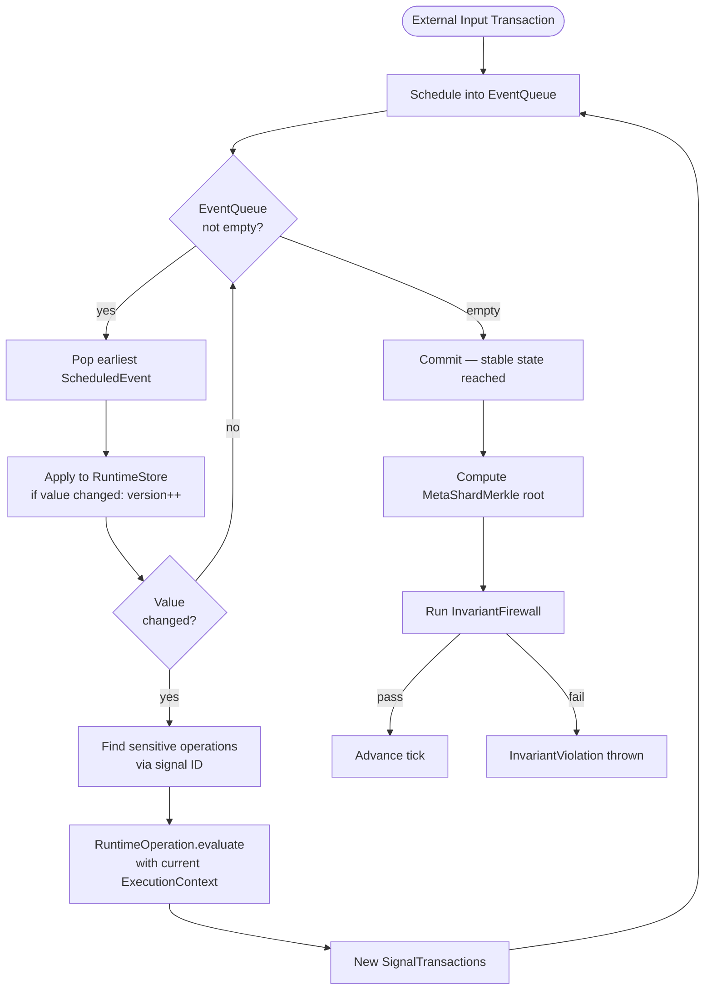

---

## Phase IV — HDL Runtime / Waveform / SPICE Verification Layer

**File:** `apple/swift/switchboard/SwitchboardPhaseIV.swift`

Phase IV extends the simulation model with the full IEEE std_logic nine-value resolution system, inertial and transport delay semantics, sensitivity-list-driven process activation, physical clock generation, setup and hold timing analysis, VCD waveform emission, and SPICE PWL voltage source generation.

### Extended std_logic

The nine-value `StdLogic` enum adds `U` (uninitialised), `W` (weak unknown), `L` (weak zero), `H` (weak one), and `-` (don't care) to the four-value Phase I system. These additional values are necessary for multi-driver resolution: weak drivers do not override strong drivers, and uninitialised values propagate differently from unknown values.

The `compact` computed property on `StdLogic` collapses the nine-value system back to the four-value system used by the Phase I execution model. `L` maps to `.zero`, `H` maps to `.one`, `U`/`W`/`-` map to `.x`. This gives a clean boundary between the HDL simulation domain (nine values) and the arithmetic execution domain (four values).

### StdLogicResolver

`StdLogicResolver.resolve` implements the pairwise resolution function of the IEEE std_logic resolution table. The key rules:

- Equal values always resolve to themselves
- `U` dominates everything — an uninitialised value propagates regardless of the other driver
- `Z` is neutral — any other value overrides high-impedance
- `X` propagates from unknown drivers unless a strong zero or one is present
- Strong values override weak values: `0` beats `L`, `0` beats `H`, `1` beats `L`, `1` beats `H`
- Strong conflict: `0` and `1` together produce `X`
- Weak conflict: `L` and `H` together produce `W`

`resolve(_ drivers: [StdLogic])` is the multi-driver reduction — it folds pairwise resolution across a sorted list of driver values, so the result is order-independent.

### ResolvedNet and ResolvedVectorNet

`ResolvedNet` is a single-bit net with a dictionary of named drivers. Each driver has an independent `StdLogic` value. When any driver changes, the net re-resolves across all current driver values in sorted driver ID order. If the resolved value changes, the version counter increments and the method returns `true` to indicate a net event.

`release` models a driver going to high-impedance — effectively removing the driver's contribution to the net without deleting it from the dictionary. This mirrors what happens when a tri-state output buffer is disabled.

`ResolvedVectorNet` applies the same logic per bit across a bus of configurable width.

### Delay Semantics

`HDLDuration` wraps a `UInt64` femtosecond count. The femtosecond granularity matches what SPICE uses for time and allows sub-picosecond delays without loss of precision.

`HDLTime` combines a femtosecond timestamp with a `UInt32` delta counter. Comparison is total: different femtosecond values compare by femtoseconds; ties break on delta.

`DelayMode` is either `transport` or `inertial`. Transport delay passes all transitions to the output regardless of pulse width. Inertial delay cancels pending transactions that fall within the reject window before the current transaction's scheduled time — this models the minimum pulse width below which a logic gate will not pass a pulse.

`DelayQueue.schedule` implements inertial rejection: before inserting a new transaction, it removes any existing pending transactions on the same net from the same driver whose scheduled time falls within the reject window. `DelayQueue.pop` returns the earliest event by time and sequence.

### Clock Generator

`ClockSpecification` describes a clock signal by its `RuntimeSignalID`, period, high time, and optional phase offset — all in `HDLDuration`. `ClockGenerator.transitions` returns a flat list of `ClockTransition` values for a given number of cycles. Each cycle produces two transitions: a rising edge at the base time and a falling edge at `base + highTime`. The base advances by `period` each iteration. Transitions carry the edge direction (`rising` or `falling`) for use by rising-edge-triggered flip-flop models.

### Timing Monitor

`TransitionHistory` records a timestamp for every signal transition during simulation. `lastTransition(of:beforeOrAt:)` finds the most recent transition of a signal at or before a given time. `firstTransition(of:after:)` finds the next transition after a given time.

`TimingMonitor.check` applies a `TimingRequirement` (setup and hold durations) relative to a clock edge time. For each data signal:

- Setup check: the most recent transition before the clock edge must be at least `setup` femtoseconds before the edge. Violation if the transition is too close.
- Hold check: the first transition after the clock edge must be at least `hold` femtoseconds after the edge. Violation if the data changes too soon.

Violations are thrown as typed `TimingViolation` errors with the margin in femtoseconds, so the caller can log the exact slack.

### VCD Waveform Emission

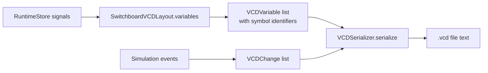

`VCDSymbolAllocator` generates compact printable ASCII symbols (characters 33–126) for use as VCD variable identifiers. The first 94 variables get single-character identifiers. After that, identifiers grow by one character per 94-symbol boundary, matching the standard VCD identifier encoding.

`VCDSerializer.serialize` emits a compliant VCD text file: `$date`, `$version`, `$timescale 1fs`, `$scope`, `$var wire` declarations, `$enddefinitions`, then a time-sorted list of value change events. Scalar changes are written as `{value}{id}\n`. Vector changes are written as `b{bits} {id}\n`. The femtosecond timestamps are emitted as integer `#n` lines at each new time value.

`SwitchboardVCDLayout.variables` assigns VCD variables to the ten primary signals: `a`, `b`, `sum_internal`, `sum`, `c0`–`c3`, `overflow`, and `enable`.

### SPICE PWL Stimulus Generator

`SPICEPWLGenerator.source` converts a list of `DigitalStimulusPoint` values — each carrying an `HDLTime` and a `Logic` value — into a SPICE `PWL` voltage source statement. Logic `zero` maps to `0.0 V`, logic `one` maps to `1.8 V`, logic `x` maps to `0.9 V` (midpoint), logic `z` maps to `0.0 V`. Times are converted from femtoseconds to seconds for SPICE notation. This allows the execution trace from Phase III to be directly converted into a SPICE testbench that drives the transistor-level circuit from Phase II.

### Logical / Physical Provenance

`ProvenanceLink` maps a `RuntimeSignalID` from the logical execution domain to a `PhysicalNet` from the CMOS domain. `SwitchboardProvenanceMap.build` returns the complete mapping for the Switchboard: `a` → `A0`, `b` → `B0`, `sum.output` → `S0`, `overflow` → `C3`, and the four carry signals to their respective physical nets. This bidirectional map is what allows a timing violation found in the logical simulation to be cross-referenced to the transistor that drives the problematic net.

---

## Phase V — Canonical IR / Equivalence Closure

**File:** `apple/swift/switchboard/SwitchboardPhaseV.swift`

Phase V defines a canonical intermediate representation that owns the topology of the Switchboard design independently of any backend. The IR can regenerate a Swift executable model, a MetaShard graph, a VHDL description, a SPICE deck, or a test manifest — all from the same source of truth.

### The Problem Phase V Solves

After four phases, there are multiple representations of the same design: the Phase I `Switchboard` machine, the Phase II `CMOSFullAdder` cell, the Phase III `MetaShardGraph`, and the Phase IV `ProcessRegistry`. Each was derived from the original VHDL description, but none of them has a formal link to the others. If the Phase I FSM transitions disagree with the Phase III operation graph, there is no automatic way to detect the discrepancy.

Phase V introduces `CanonicalSwitchboardIR` as the single source of truth. Every other representation is a projection from the IR. The IR is validated by `CanonicalIRFirewall` before any machine is constructed from it. The IR is encoded to a deterministic `Digest256`. Any two representations that both claim to derive from the same IR can compare digests to verify that they started from the same specification.

### CanonicalSwitchboardIR Structure

The IR has six sections:

**Signals:** Every port and internal net, each with a direction (`input`, `output`, `internalSignal`) and a type (`logic`, `vector(width:)`, `state`). Fifteen signals in the Switchboard: CLK, RESET, A, B, SUM, OVERFLOW, STATE (output), S_INT, C0–C3, ENABLE, ST (state register), ST_NEXT.

**States:** The three FSM states with their two-bit binary encodings: IDLE=0b00, READ=0b01, WRITE=0b10.

**Components:** The eight structural cells: FA0–FA3, the tri-state buffer, the overflow alias, the FSM decoder, and the FSM register.

**Connections:** The structural netlist expressed as `CanonicalConnection` values between typed `CanonicalEndpoint` values. Endpoints are either signals, component ports, or constants (a `StdLogic` value). The carry chain is expressed as explicit connections from each FA(n).COUT signal to FA(n+1).CIN, and the C3 → OVERFLOW connection closes the overflow invariant.

**Transitions:** The FSM transition table as `CanonicalTransition` values with explicit conditions and priorities. Reset transitions have priority 100. Normal transitions have priority 10. `CanonicalTransitionEngine.next` iterates candidates sorted by priority descending and returns the first matching transition.

**Invariants:** The seven invariants as `CanonicalInvariant` values with kind tags and human-readable descriptions. The kind taxonomy matches the Phase I invariant IDs: `width`, `carryChain`, `overflowAlias`, `legalState`, `reset`, `transition`, `structuralCardinality`.

### CanonicalIRFirewall

The firewall verifies the IR in seven passes before any machine is constructed:

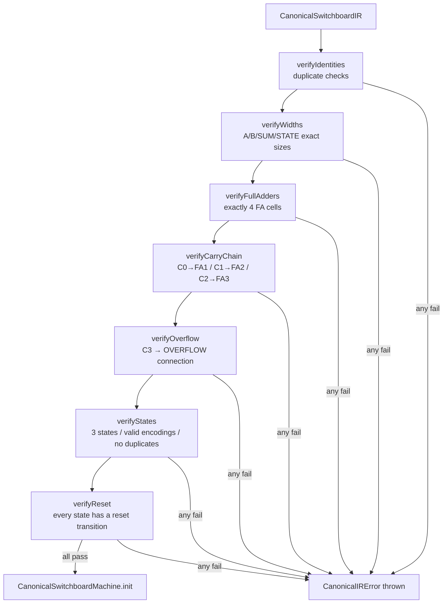

The `CanonicalSwitchboardMachine` constructor takes `throws` and calls `CanonicalIRFirewall.verify` before storing the IR. A machine that has been successfully constructed is guaranteed to have a valid IR.

### Canonical Execution

`CanonicalDatapathExecutor.evaluate` runs the four-cell carry chain directly from the IR, without routing through `RippleAdder4`. It is a deliberate re-implementation — the point is that two separate implementations of the same specification must agree, and if they do not, the IR is the authority that defines what is correct.

`CanonicalTransitionEngine.next` evaluates the FSM transition table from the IR's `transitions` array. Reset (`priority=100`) always takes precedence over normal transitions (`priority=10`). `anyInputNonZero` matches when any bit of either input bus is `one`. `always` is unconditional.

`CanonicalSwitchboardMachine.evaluate` and `clock` mirror the Phase I `Switchboard` API exactly. The same test vectors can be driven through both machines and the snapshots compared field by field.

### Canonical Encoding and Equivalence

`CanonicalIREncoder.encode` serialises the entire IR to a `ByteBuffer` in a deterministic canonical form. Every collection is sorted before encoding — signals by ID, states by ID, components by ID, connections by a string representation of source and target, transitions by from/priority/to, invariants by ID. The result is the same byte sequence regardless of the order in which the IR was constructed.

`CanonicalIREncoder.digest` returns a `Digest256` of that byte sequence. Two IRs with the same logical content will always produce the same digest.

`EquivalenceWitness` collects three digests: the canonical IR digest, the Swift execution digest (derived from a MetaShard Merkle root after simulating the machine), and the SPICE deck digest (from the Phase II SPICE generator). When all three agree, `agreed` is true and the equivalence closure is established.

`CanonicalManifest` bundles the IR, the equivalence report, and summary statistics into a single value with a human-readable `description`. It is the artifact that proves the five-phase pipeline produced consistent representations.

---

## Switchboard — Invariant Table

| ID | Phase | Kind | Description |
|----|-------|------|-------------|
| I2 | I | width | A and B buses are exactly four bits |
| I3 | I | carryChain | Each carry bit verified by independent full adder |
| I4 | I | overflowAlias | Overflow equals final carry C3 |
| I5 | I | legalState | FSM is one of IDLE / READ / WRITE |
| I6 | I | reset | Reset forces IDLE; transition graph is correct |
| PhysicalPort | II | portPresence | All seven ports present in physical cell |
| UniqueDevice | II | uniqueness | No duplicate device IDs in physical cell |
| BodyConnection | II | bodyPolicy | NMOS body=VSS; PMOS body=VDD |
| CarryPhysical | II | carryChain | Physical carry chain topology validated |
| OverflowPhysical | II | overflowAlias | Physical C3 terminates at overflow node |
| STRUCTURE.FA | V | structuralCardinality | Exactly four full-adder cells in canonical IR |
| I6.TRANSITION | V | transition | IDLE→READ→WRITE→IDLE structure in IR |

---

## Switchboard — Signal Reference

| Signal | Domain | Width | Direction | Description |
|--------|--------|-------|-----------|-------------|
| a | Logical | 4 | input | First addend |
| b | Logical | 4 | input | Second addend |
| reset | Logical | 1 | input | Synchronous reset — forces IDLE |
| state | Logical | 1 | internal | Current FSM state register |
| state.next | Logical | 1 | internal | Next FSM state (combinational) |
| sum.internal | Logical | 4 | internal | Ripple adder sum (always valid) |
| sum.output | Logical | 4 | output | Gated sum — valid only in READ state |
| carry.c0 | Logical | 1 | internal | Carry from bit 0 → bit 1 |
| carry.c1 | Logical | 1 | internal | Carry from bit 1 → bit 2 |
| carry.c2 | Logical | 1 | internal | Carry from bit 2 → bit 3 |
| carry.c3 | Logical | 1 | internal | Final carry / overflow |
| overflow | Logical | 1 | output | Aliases carry.c3 |
| enable | Logical | 1 | internal | High in READ state — tri-state control |
| cycle | Logical | 64 | internal | Clock cycle counter |

---

## Switchboard — Full Lowering Pipeline

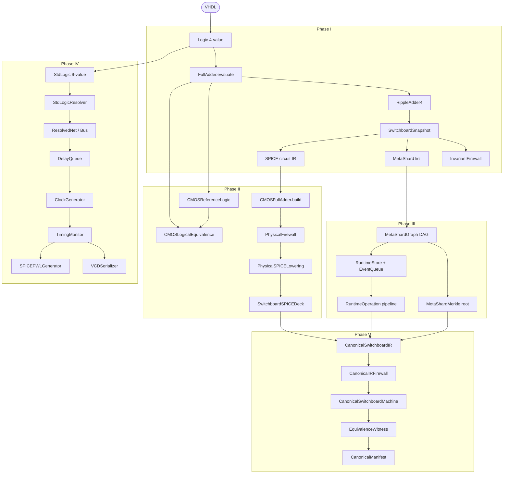

---

## Switchboard — FSM State Machine

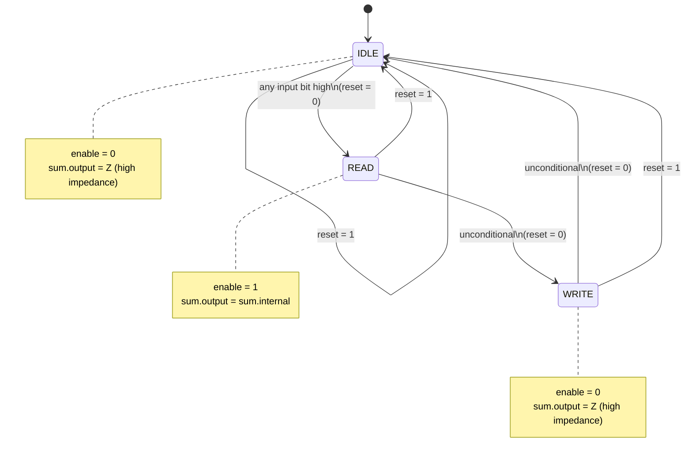

---

## Switchboard — Full Adder CMOS Topology

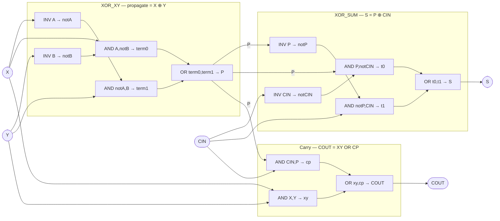
---

## Switchboard — Phase IV Simulation Loop

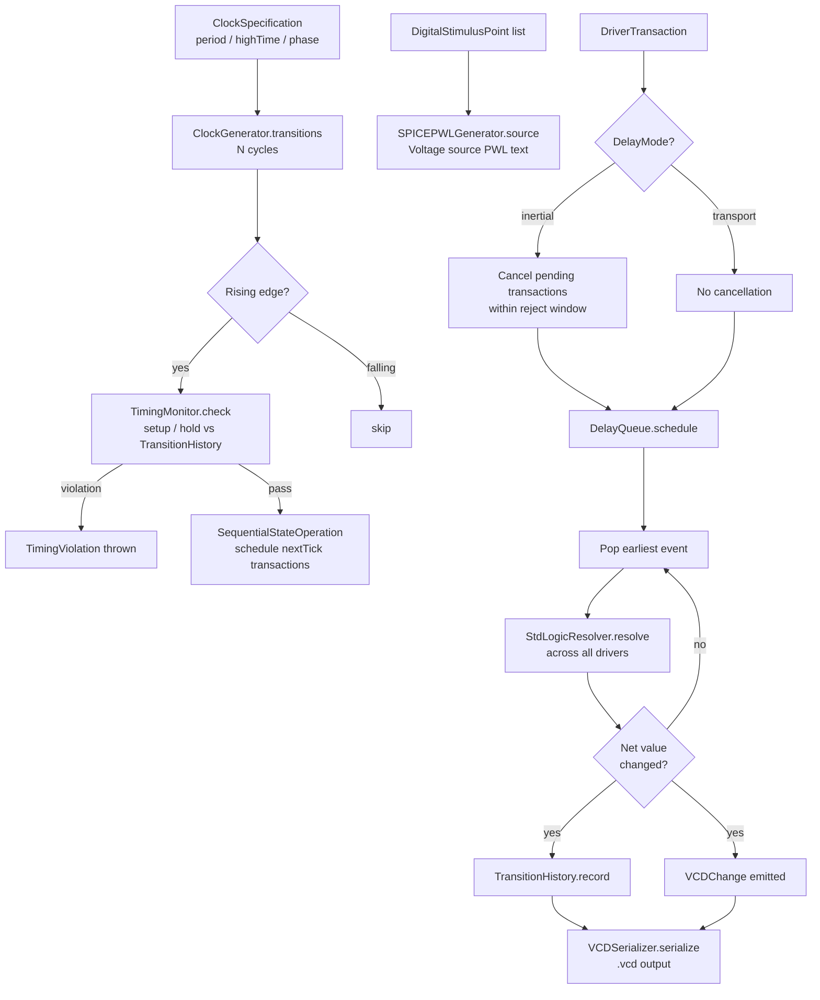

---

## License

See [LICENSE](LICENSE) for details.
