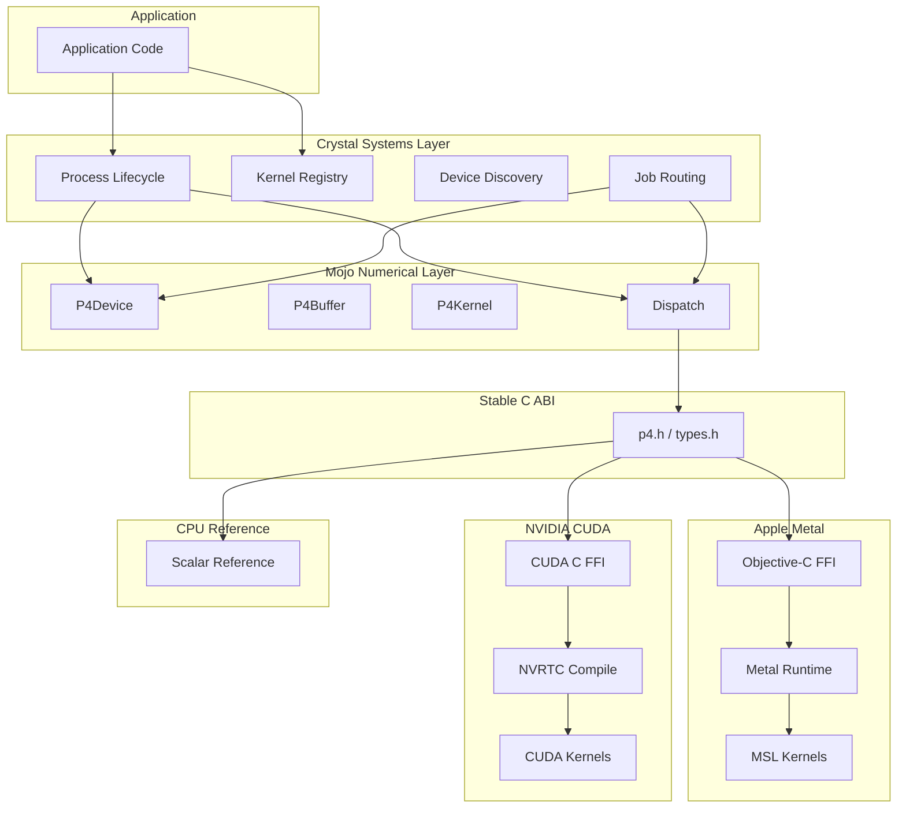
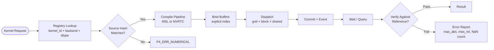
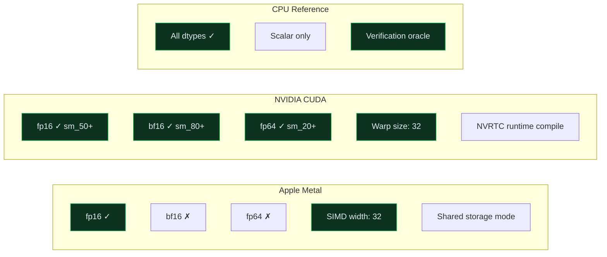
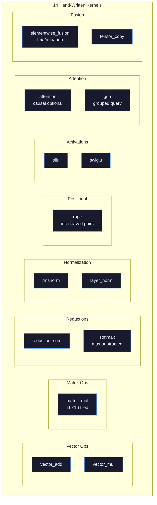

```
┌─────────────────────────────────────────────────────────────────────────────┐
│                                                                             │
│   ██████╗ ██╗  ██╗                                                          │
│   ██╔══██╗██║  ██║                                                          │
│   ██████╔╝███████║                                                          │
│   ██╔═══╝ ╚════██║                                                          │
│   ██║          ██║                                                          │
│   ╚═╝          ╚═╝                                                          │
│                                                                             │
│   ███████╗ ██████╗ ██╗   ██╗███████╗██████╗ ███████╗██╗ ██████╗ ███╗   ██╗ │
│   ██╔════╝██╔═══██╗██║   ██║██╔════╝██╔══██╗██╔════╝██║██╔════╝ ████╗  ██║ │
│   ███████╗██║   ██║██║   ██║█████╗  ██████╔╝█████╗  ██║██║  ███╗██╔██╗ ██║ │
│   ╚════██║██║   ██║╚██╗ ██╔╝██╔══╝  ██╔══██╗██╔══╝  ██║██║   ██║██║╚██╗██║ │
│   ███████║╚██████╔╝ ╚████╔╝ ███████╗██║  ██║███████╗██║╚██████╔╝██║ ╚████║ │
│   ╚══════╝ ╚═════╝   ╚═══╝  ╚══════╝╚═╝  ╚═╝╚══════╝╚═╝ ╚═════╝ ╚═╝  ╚═══╝│
│                                                                             │
│   ██████╗ ██████╗ ██╗   ██╗    ███████╗███████╗██╗    ███████╗████████╗     │
│   ██╔════╝ ██╔══██╗██║   ██║    ██╔════╝██╔════╝██║    ██╔════╝╚══██╔══╝     │
│   ██║  ███╗██████╔╝██║   ██║    █████╗  █████╗  ██║    ███████╗   ██║        │
│   ██║   ██║██╔═══╝ ██║   ██║    ██╔══╝  ██╔══╝  ██║    ╚════██║   ██║        │
│   ╚██████╔╝██║     ╚██████╔╝    ██║     ██║     ██║    ███████║   ██║        │
│    ╚═════╝ ╚═╝      ╚═════╝     ╚═╝     ╚═╝     ╚═╝    ╚══════╝   ╚═╝        │
│                                                                             │
│   Hand-Rolled GPU Compute · Metal + CUDA · Unified C ABI                    │
│   No frameworks · No fallbacks · Deterministic dispatch                     │
│                                                                             │
└─────────────────────────────────────────────────────────────────────────────┘
```


---

## What is this?

P4 is a hand-rolled, low-level GPU compute stack that exposes native Apple Metal and NVIDIA CUDA kernels through a unified FFI architecture. Every kernel is hand-written. Every interface is explicit. Nothing is delegated to a framework.

Six layers, one stable C ABI boundary between them:

- **ABI** — Stable C types, opaque handles, kernel IDs. The line that nothing crosses except plain C.
- **Apple Metal** — Objective-C FFI to Metal runtime. Hand-written MSL kernels. No MPS. No MetalKit.
- **NVIDIA CUDA** — CUDA runtime + NVRTC compile. Hand-written CUDA kernels. No cuDNN. No cuBLAS.
- **Mojo** — Numerical layer. Device abstraction, buffer management, kernel dispatch. Owns the math API.
- **Crystal** — Systems orchestration. Process lifecycle, kernel registry, device discovery, job routing.
- **CPU Reference** — Scalar reference implementations for every kernel. Verification oracle.

15 constraints enforced. No cloud GPU dependency. No SaaS inference. No mandatory Python runtime. No silent backend fallback. Explicit failure on unsupported capabilities.

---

## Architecture



## Kernel Dispatch Pipeline



## Backend Capabilities



## Kernel Matrix



---

## Design Constraints

| ID | Constraint | Enforcement |
|----|-----------|-------------|
| P4-1 | No cloud GPU dependency | All compute is local hardware |
| P4-2 | No SaaS inference dependency | No external API calls |
| P4-3 | No mandatory Python runtime | C ABI + Mojo + Crystal |
| P4-4 | No high-level GPU framework in core | No MPS, cuDNN, cuBLAS |
| P4-5 | Objective-C handles Apple Metal boundary | Direct Metal API |
| P4-6 | MSL kernels are hand-written | 13 kernels in p4_kernels.metal |
| P4-7 | CUDA kernels are hand-written | 12 kernels in p4_kernels.cu |
| P4-8 | Mojo owns numerical/kernel API | Device, Buffer, Kernel structs |
| P4-9 | Crystal owns systems orchestration | Registry, Runtime, routing |
| P4-10 | C ABI is stable interop boundary | abi/p4.h + abi/types.h |
| P4-11 | Cross-backend mathematical contracts | FNV-1a source hashing |
| P4-12 | Every kernel independently testable | Per-kernel verification API |
| P4-13 | Reproducible version & source hashes | version.h + kernel_record |
| P4-14 | Explicit failure on unsupported caps | P4_ERR_UNSUPPORTED |
| P4-15 | No silent backend fallback | P4_ERR_NO_FALLBACK |

---

## Project Structure

```
p4/
├── abi/                          Stable C ABI
│   ├── p4.h                      Single interoperability boundary
│   ├── types.h                   Primitive types, opaque handles, kernel IDs
│   └── version.h                 Version and ABI version
│
├── apple/                        Apple Metal Backend
│   ├── objc/
│   │   ├── p4_metal.h            Public C header
│   │   └── p4_metal.m            Objective-C implementation
│   └── msl/
│       └── p4_kernels.metal      14 hand-written MSL kernels
│
├── nvidia/                       NVIDIA CUDA Backend
│   ├── cuda/
│   │   ├── p4_cuda.h             Public C header
│   │   └── p4_cuda.cu            CUDA runtime + NVRTC implementation
│   └── kernels/
│       └── p4_kernels.cu         12 hand-written CUDA kernels
│
├── mojo/                         Mojo Numerical Layer
│   ├── ffi/
│   │   └── p4_ffi.mojo           C ABI bindings
│   ├── device/
│   │   └── p4_device.mojo        Backend-neutral device API
│   └── kernels/
│       └── p4_kernels.mojo       Kernel dispatch + named constructors
│
├── crystal/                      Crystal Systems Layer
│   ├── registry/
│   │   └── p4_registry.cr        Kernel registry + hash verification
│   └── runtime/
│       ├── abi.cr                 Crystal C ABI bindings
│       └── p4_runtime.cr         Device discovery + job routing
│
├── reference/                    CPU Reference (verification oracle)
│   └── numerical/
│       └── ops/
│
├── tests/                        Verification suite
├── benchmarks/                   Performance layer
├── docs/                         Architecture documentation
└── scripts/                      Build scripts
```

---

## Build

Platform-specific. Metal backend requires macOS + Xcode. CUDA backend requires nvcc + NVRTC.

```bash
# Apple Metal (macOS)
clang -framework Metal -framework Foundation -c apple/objc/p4_metal.m -o build/p4_metal.o
xcrun metal -c apple/msl/p4_kernels.metal -o build/p4_kernels.air

# NVIDIA CUDA
nvcc -c nvidia/kernels/p4_kernels.cu -o build/p4_kernels.o
nvcc -c nvidia/cuda/p4_cuda.cu -o build/p4_cuda.o -lnvrtc

# Mojo
mojo build mojo/ffi/p4_ffi.mojo

# Crystal
crystal build crystal/runtime/p4_runtime.cr
```

---

## License

See [LICENSE](LICENSE) for details.
